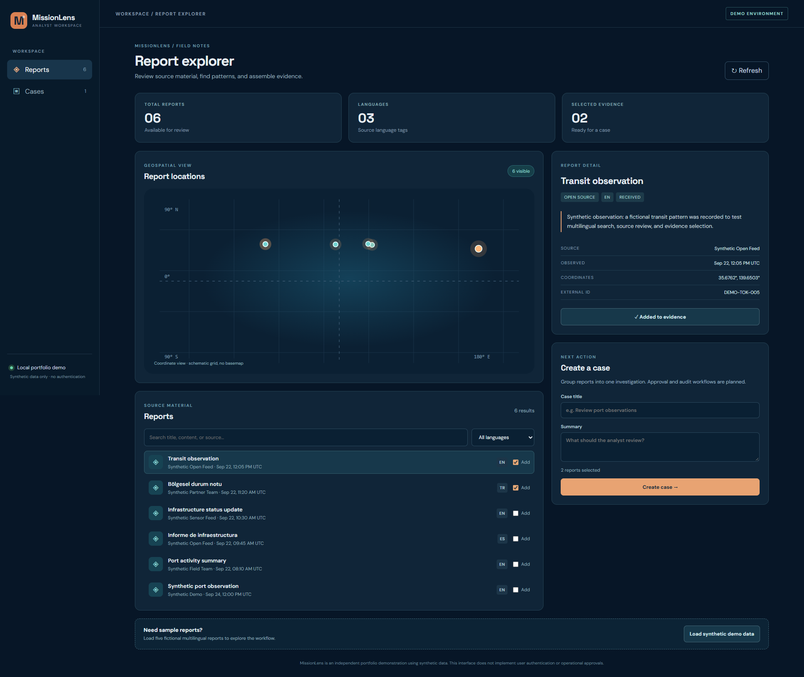
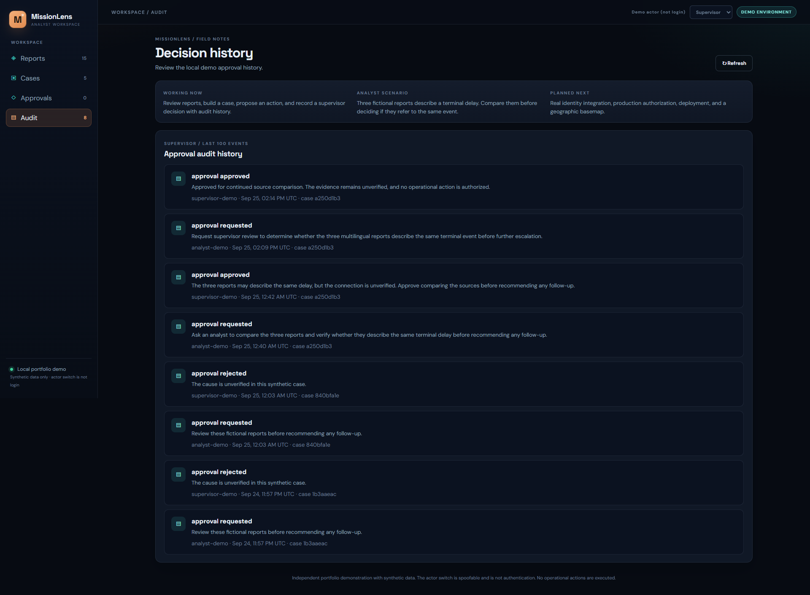
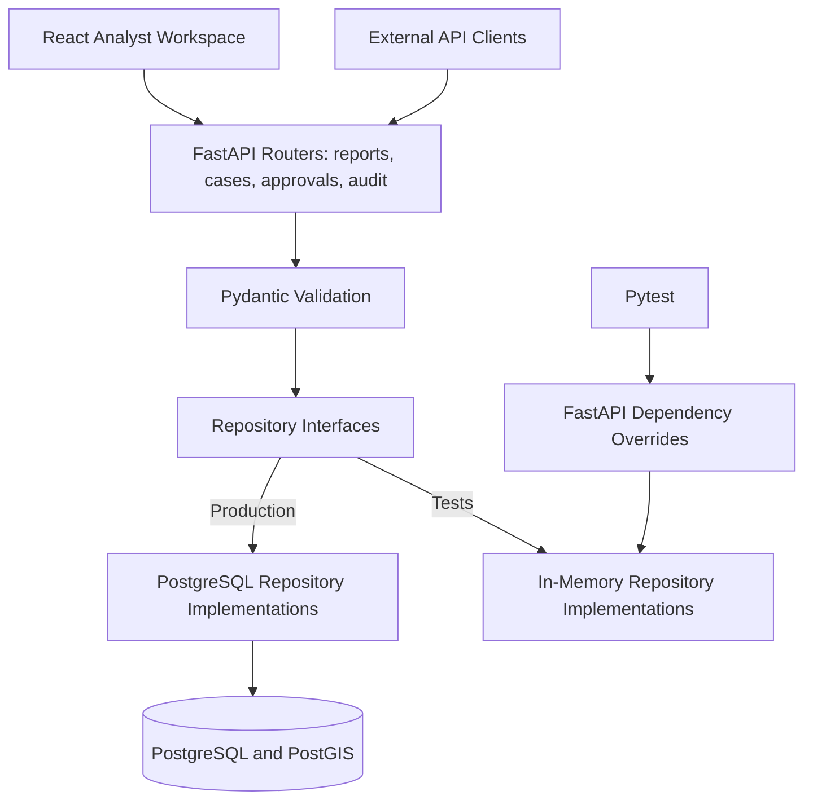

# MissionLens

MissionLens is a portfolio-scale mission intelligence platform for ingesting, validating, searching, and reviewing multilingual geospatial reports.

The current implementation pairs a tested FastAPI and PostgreSQL/PostGIS backend with a React analyst workspace for reviewing reports and creating cases from selected evidence.

> MissionLens is an independent portfolio project. It uses only synthetic demonstration data and is not affiliated with any government organization.

## Five-minute tour

**Working now:** Ingest and search reports, select evidence, save a case, request supervisor review of a proposed action, and record a decision with audit events. The React workspace and PostgreSQL/PostGIS backend run locally.

**Planned next:** Real identity integration, production authorization, a geographic basemap, and deployment. The demo actor switch is spoofable and is not authentication; use synthetic data on localhost only.

**Analyst scenario:** Three fictional English, Turkish, and Spanish reports describe a delay near the same terminal. Their sources do not establish a cause. Load the sample reports, compare the three observations, and create a case that records what still needs verification. Two unrelated reports show why selecting evidence matters.

## Product Walkthrough

### Analyst report explorer

Analysts can search multilingual reports, review source and geospatial context, and select evidence for an investigation case.



### Supervisor decision history

Supervisors can review proposed actions, record reasoned decisions, and inspect the corresponding audit history. The demonstration records decisions but does not execute operational actions.



## Current Status

The working local demonstration supports:

- Validated multilingual report ingestion
- Durable PostgreSQL storage
- PostGIS point geometry using SRID 4326
- Language and source-type filtering
- Geographic bounding-box search
- Create and retrieve cases linked to existing report evidence
- Preserve the order of reports selected as case evidence
- Duplicate ingestion protection
- Alembic database migrations
- FastAPI dependency injection
- Separate production and test repositories
- Automated API tests and a PostGIS persistence workflow in CI
- Docker Compose infrastructure for PostgreSQL/PostGIS, Redis, and MinIO
- API liveness through `/health` and database readiness through `/ready`
- React and TypeScript workspace for browsing reports, reviewing source details, selecting evidence, and creating cases
- Schematic coordinate view of report locations and five repeatable synthetic sample reports
- Demo analyst requests, supervisor decisions, and database audit events; no external action is executed

Authentication, case editing, a geographic basemap, Redis integration, and object-storage integration remain planned. Do not expose the local demo API to real users or sensitive data.

## Problem

Mission teams may receive large amounts of information from different sources, locations, formats, and languages. Fragmented systems make it difficult to:

- Find relevant information quickly
- Connect reports involving the same location or event
- Establish source and provenance
- Prioritize time-sensitive cases
- Control sensitive actions
- Maintain a complete audit history

MissionLens demonstrates a local workflow for discovering, reviewing, and connecting synthetic reports before recording a proposed decision. It does not execute operational actions.

## Users

### Analyst

- Searches and filters reports
- Reviews source, time, language, and location metadata
- Visualizes events on a map
- Creates investigation cases
- Submits proposed actions for approval

### Supervisor

- Reviews proposed actions and supporting evidence
- Approves or rejects sensitive actions
- Records decision explanations
- Reviews case and audit history

### Administrator

- Manages users and roles
- Configures system integrations
- Reviews security events
- Monitors system health

## Implemented Architecture



Production requests receive SQLAlchemy sessions through FastAPI dependency injection and use PostgreSQL-backed repository implementations. Tests override those dependencies with in-memory implementations. This keeps the HTTP and validation layers independent of concrete persistence while supporting the reports, cases, approvals, and audit workflow.

This keeps the HTTP layer independent of a specific persistence implementation.

## API

### Health

```http
GET /health
```

Returns the service name, version, health status, and UTC timestamp.

`GET /ready` checks the database connection and returns HTTP `503` if PostgreSQL is unavailable. `/health` checks only that the API process is running.

### Ingest a report

```http
POST /api/v1/reports
```

The endpoint:

1. Validates the request with Pydantic.
2. Rejects malformed coordinates and timezone-free timestamps.
3. Converts longitude and latitude into a PostGIS point.
4. Persists the normalized report in PostgreSQL.
5. Returns HTTP `409` when `external_id` already exists.

### Search reports

```http
GET /api/v1/reports
```

Supported filters:

- `query` (case-insensitive title, content, source name, and external ID search)
- `language`
- `source_type`
- `min_latitude`
- `max_latitude`
- `min_longitude`
- `max_longitude`
- `limit` (1–100, default 20)
- `offset` (zero-based)

Results have a stable order and the `X-Total-Count` response header gives the number of matching reports across all pages. `GET /api/v1/reports/languages` returns available language tags. Geographic search uses a PostGIS envelope and `ST_Intersects`; all four bounding-box coordinates must be provided together. Keyword search currently uses substring matching, so an index or full-text search will be needed at larger scale.

### Create and review a case

```http
POST /api/v1/cases
GET /api/v1/cases
GET /api/v1/cases/{case_id}
```

Create a case with a title, summary, and one or more existing report IDs:

```json
{
  "title": "Review synthetic observation",
  "summary": "Compare the linked reports before proposing any action.",
  "report_ids": ["<UUID returned by POST /api/v1/reports>"]
}
```

Missing reports reject the whole request with HTTP `422`; duplicate report IDs are rejected. The case and its ordered report links are saved in one database transaction. Case responses include report titles in evidence order; the case list loads those titles in a batch.

### Local demo approval and audit flow

```http
POST /api/v1/cases/{case_id}/approvals
GET /api/v1/approvals
POST /api/v1/approvals/{approval_id}/decision
GET /api/v1/audit-events
```

The request endpoint accepts an `action_description`. The decision endpoint accepts `{"decision":"approved" | "rejected", "reason":"..."}`; decisions are final and do not execute any action. For the local demo, set `X-Demo-Actor: analyst-demo` when requesting approval and `X-Demo-Actor: supervisor-demo` when deciding or viewing audit events. The actor header is **user-controlled and spoofable**. It tests workflow roles, not real identity or access control. Approval state and its corresponding audit event are committed together; a database trigger rejects updates or deletes of audit events. Production use requires a trusted identity provider and a separate security review.

Interactive OpenAPI documentation is available at:

```text
http://127.0.0.1:8000/docs
```

## Technology Stack

### Implemented

- Python
- FastAPI
- Pydantic
- SQLAlchemy
- Alembic
- PostgreSQL
- PostGIS
- GeoAlchemy2
- Psycopg
- Pytest
- Docker Compose

### Infrastructure Available for Later Integration

- Redis
- MinIO S3-compatible object storage

### Implemented Frontend

- React
- TypeScript
- Vite

The coordinate view is a schematic SVG plot; MapLibre and frontend test automation remain planned.

## Local Setup

### 1. Create and activate the virtual environment

```powershell
py -m venv .venv

Set-ExecutionPolicy -Scope Process -ExecutionPolicy RemoteSigned

.\.venv\Scripts\Activate.ps1
```

### 2. Install dependencies

```powershell
python -m pip install -r backend\requirements-dev.txt
```

### 3. Create the local environment file

```powershell
Copy-Item .env.example .env
```

The local `.env` file is ignored by Git and must not contain production credentials.
The Compose services bind to `127.0.0.1` for this local demonstration.

### 4. Start local infrastructure

Ensure Docker Desktop is running, then execute:

```powershell
docker compose `
    --env-file .env `
    -f infrastructure\compose.yaml `
    up -d
```

Check service status:

```powershell
docker compose `
    --env-file .env `
    -f infrastructure\compose.yaml `
    ps
```

### 5. Apply database migrations

```powershell
python -m alembic upgrade head
```

Check the active migration:

```powershell
python -m alembic current
```

### 6. Run the API

```powershell
python -m uvicorn backend.app.main:app --reload
```

Open:

```text
http://127.0.0.1:8000/docs
```

### 7. Run tests

```powershell
python -m pytest backend\tests -q
```

The full suite also contains one PostGIS integration test that is skipped in ordinary local runs. GitHub Actions starts an isolated PostGIS service, applies migrations, and runs that test alongside the API tests and the frontend build. The CI database uses synthetic data only.

### 8. Run the analyst workspace

Leave the API running in its own terminal. From a second terminal:

```powershell
cd frontend
npm.cmd install
npm.cmd run dev
```

Open `http://127.0.0.1:5173`. Click **Load synthetic demo data** to add five fictional reports (duplicates are skipped). Click **Draft example case** to prefill three linked observations for review; nothing is submitted until you create the case. Propose an action, switch to the **Supervisor** demo actor, record a reasoned decision, and view the audit history. No external action runs. Search and pagination run through FastAPI, and the location grid displays the current results page. The Vite development server forwards `/api` requests to FastAPI on port 8000.

For a production frontend build, run `npm.cmd run build` inside `frontend`.

## Design Decisions

### Repository abstraction

The API depends on a `ReportRepository` contract rather than a concrete database implementation. Production uses PostgreSQL; unit tests use memory.

### Durable duplicate protection

`external_id` has a database-level unique constraint. The service translates PostgreSQL unique-constraint violations into a stable HTTP `409` API response.

### Native geospatial search

Locations are stored as PostGIS `POINT` values using SRID 4326. Bounding-box filtering executes inside PostgreSQL rather than loading every report into application memory.

### Schema migrations

Alembic manages application-owned database objects. Migration filtering prevents autogeneration from treating PostGIS extension tables as application tables.

### Layered validation

Pydantic validates API inputs, while PostgreSQL provides durable integrity guarantees. This protects both the customer-facing contract and stored data.

### Isolated tests

FastAPI dependency overrides keep unit tests fast and deterministic without weakening the production architecture.

## Target Workflow

1. Ingest a synthetic multilingual report.
2. Validate its source, language, timestamp, and location.
3. Store and spatially index the normalized report.
4. Search by language, source, time, keyword, and location.
5. Display matching events on an analyst map.
6. Add relevant reports to an investigation case.
7. Submit a proposed action for local demo supervisor review.
8. Record an approval or rejection, without executing the proposed action.
9. Persist request and decision events in an append-only database table.

## Planned Architecture

- React analyst workspace for reports, cases, and demo approvals (basemap planned)
- FastAPI services for reports, cases, demo approvals, and audit events (trusted identity planned)
- Redis for caching, rate limiting, job state, and idempotency
- MinIO for original reports and multimedia
- Background ingestion and metadata-normalization workers
- Role-based access control
- Structured logging and request correlation
- Metrics, alerts, backup, and recovery procedures
- Government-environment identity and SIEM adapters

## Security Principles

Future production deployment would require trusted identity, independent authorization enforcement, security review, and operational controls. The local demo currently has input validation, a localhost-only database port, atomic approval/audit writes, and a database trigger that rejects audit-event modification. Planned controls include:

- Least-privilege authorization
- Role-based access control
- Human approval for sensitive actions
- Traceable audit events
- Strict input validation
- Idempotent ingestion
- Secrets separation
- Secure configuration defaults
- Dependency and container scanning
- Operational observability

## Delivery Phases

### Phase 1: Backend Vertical Slice — Complete

- Health endpoint
- Validated multilingual ingestion
- Report search
- Geographic filtering
- Automated tests

### Phase 2: Durable Data Foundation — Database Complete

- PostgreSQL/PostGIS persistence
- Alembic migrations
- Docker Compose infrastructure
- Repository-based dependency injection

Redis and MinIO containers are available, but application integration is planned.

### Phase 3: Mission Workflow

- React analyst workspace — report browsing, schematic location view, case creation, and demo approval review implemented; MapLibre basemap planned
- Cases and evidence organization — create/list/detail API and case creation UI implemented; case editing planned
- Proposed actions
- Demo supervisor approval decisions (real user authentication planned)
- Append-only approval audit events

### Phase 4: Deployment and Operations

- Containerized application deployment
- Identity integration
- Monitoring and alerting
- Backup and recovery
- Performance and failure testing
- Operational runbooks

### Phase 5: RMF-Informed Documentation

- System boundary
- Data-flow diagram
- Control responsibility matrix
- Risk register
- Incident-response procedure
- Evidence index

## Success Criteria

- Privileged endpoints verify authenticated user roles before any real-user rollout.
- Every approval decision creates an audit event.
- Duplicate ingestion is handled safely.
- Critical workflows have automated test coverage.
- Search requests meet documented performance targets.
- A new developer can start the application using documented commands.
- Failures are observable and supported by recovery procedures.

## Important Boundaries

- MissionLens is an independent portfolio project.
- It is not affiliated with any government organization.
- It does not use classified, controlled, or proprietary information.
- All demonstration data is synthetic or openly licensed.
- "RMF-informed" does not mean RMF-certified or government-authorized.
