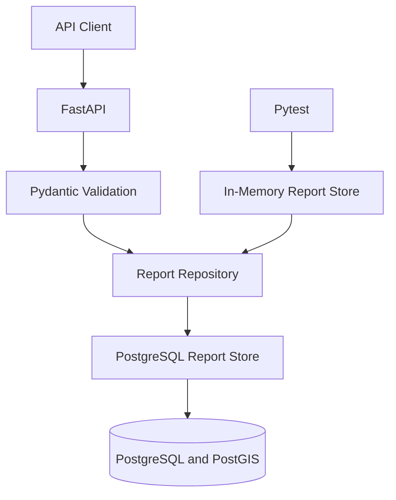

# MissionLens

MissionLens is a portfolio-scale mission intelligence platform for ingesting, validating, searching, and reviewing multilingual geospatial reports.

The current implementation is a tested FastAPI backend with durable PostgreSQL/PostGIS persistence. The broader product vision includes an analyst map, investigation cases, approval-controlled actions, object storage, caching, and audit history.

> MissionLens is an independent portfolio project. It uses only synthetic demonstration data and is not affiliated with any government organization.

## Current Status

The operational backend currently supports:

- Validated multilingual report ingestion
- Durable PostgreSQL storage
- PostGIS point geometry using SRID 4326
- Language and source-type filtering
- Geographic bounding-box search
- Duplicate ingestion protection
- Alembic database migrations
- FastAPI dependency injection
- Separate production and test repositories
- Automated API tests
- Docker Compose infrastructure for PostgreSQL/PostGIS, Redis, and MinIO
- Health monitoring through `/health`

Cases, approvals, audit events, authentication, the React analyst interface, Redis integration, and object-storage integration remain planned.

## Problem

Mission teams may receive large amounts of information from different sources, locations, formats, and languages. Fragmented systems make it difficult to:

- Find relevant information quickly
- Connect reports involving the same location or event
- Establish source and provenance
- Prioritize time-sensitive cases
- Control sensitive actions
- Maintain a complete audit history

MissionLens is designed to provide one controlled workflow for discovering, reviewing, connecting, and acting on mission-relevant information.

## Users

### Analyst

- Searches and filters reports
- Reviews source, time, language, and location metadata
- Visualizes events on a map
- Creates investigation cases
- Submits proposed actions for approval

### Supervisor

- Reviews proposed actions and supporting evidence
- Approves or rejects sensitive actions
- Records decision explanations
- Reviews case and audit history

### Administrator

- Manages users and roles
- Configures system integrations
- Reviews security events
- Monitors system health

## Implemented Architecture



Production requests receive a SQLAlchemy session through FastAPI dependency injection and use `PostgresReportStore`. Unit tests override the same repository dependency with the thread-safe in-memory `ReportStore`.

This keeps the HTTP layer independent of a specific persistence implementation.

## API

### Health

```http
GET /health
```

Returns the service name, version, health status, and UTC timestamp.

### Ingest a report

```http
POST /api/v1/reports
```

The endpoint:

1. Validates the request with Pydantic.
2. Rejects malformed coordinates and timezone-free timestamps.
3. Converts longitude and latitude into a PostGIS point.
4. Persists the normalized report in PostgreSQL.
5. Returns HTTP `409` when `external_id` already exists.

### Search reports

```http
GET /api/v1/reports
```

Supported filters:

- `language`
- `source_type`
- `min_latitude`
- `max_latitude`
- `min_longitude`
- `max_longitude`

Geographic search uses a PostGIS envelope and `ST_Intersects`. All four bounding-box coordinates must be provided together.

Interactive OpenAPI documentation is available at:

```text
http://127.0.0.1:8000/docs
```

## Technology Stack

### Implemented

- Python
- FastAPI
- Pydantic
- SQLAlchemy
- Alembic
- PostgreSQL
- PostGIS
- GeoAlchemy2
- Psycopg
- Pytest
- Docker Compose

### Infrastructure Available for Later Integration

- Redis
- MinIO S3-compatible object storage

### Planned Frontend

- React
- TypeScript
- Vite
- MapLibre
- Vitest

## Local Setup

### 1. Create and activate the virtual environment

```powershell
py -m venv .venv

Set-ExecutionPolicy -Scope Process -ExecutionPolicy RemoteSigned

.\.venv\Scripts\Activate.ps1
```

### 2. Install dependencies

```powershell
python -m pip install -r backend\requirements-dev.txt
```

### 3. Create the local environment file

```powershell
Copy-Item .env.example .env
```

The local `.env` file is ignored by Git and must not contain production credentials.

### 4. Start local infrastructure

Ensure Docker Desktop is running, then execute:

```powershell
docker compose `
    --env-file .env `
    -f infrastructure\compose.yaml `
    up -d
```

Check service status:

```powershell
docker compose `
    --env-file .env `
    -f infrastructure\compose.yaml `
    ps
```

### 5. Apply database migrations

```powershell
python -m alembic upgrade head
```

Check the active migration:

```powershell
python -m alembic current
```

### 6. Run the API

```powershell
python -m uvicorn backend.app.main:app --reload
```

Open:

```text
http://127.0.0.1:8000/docs
```

### 7. Run tests

```powershell
python -m pytest backend\tests -q
```

## Design Decisions

### Repository abstraction

The API depends on a `ReportRepository` contract rather than a concrete database implementation. Production uses PostgreSQL; unit tests use memory.

### Durable duplicate protection

`external_id` has a database-level unique constraint. The service translates PostgreSQL unique-constraint violations into a stable HTTP `409` API response.

### Native geospatial search

Locations are stored as PostGIS `POINT` values using SRID 4326. Bounding-box filtering executes inside PostgreSQL rather than loading every report into application memory.

### Schema migrations

Alembic manages application-owned database objects. Migration filtering prevents autogeneration from treating PostGIS extension tables as application tables.

### Layered validation

Pydantic validates API inputs, while PostgreSQL provides durable integrity guarantees. This protects both the customer-facing contract and stored data.

### Isolated tests

FastAPI dependency overrides keep unit tests fast and deterministic without weakening the production architecture.

## Target Workflow

1. Ingest a synthetic multilingual report.
2. Validate its source, language, timestamp, and location.
3. Store and spatially index the normalized report.
4. Search by language, source, time, keyword, and location.
5. Display matching events on an analyst map.
6. Add relevant reports to an investigation case.
7. Submit a proposed action for supervisor approval.
8. Approve or reject the action.
9. Record important events in an append-only audit trail.

## Planned Architecture

- React analyst workspace for search, maps, cases, and approvals
- FastAPI services for reports, cases, approvals, users, and audit events
- Redis for caching, rate limiting, job state, and idempotency
- MinIO for original reports and multimedia
- Background ingestion and metadata-normalization workers
- Role-based access control
- Structured logging and request correlation
- Metrics, alerts, backup, and recovery procedures
- Government-environment identity and SIEM adapters

## Security Principles

MissionLens is designed around:

- Least-privilege authorization
- Role-based access control
- Human approval for sensitive actions
- Traceable audit events
- Strict input validation
- Idempotent ingestion
- Secrets separation
- Secure configuration defaults
- Dependency and container scanning
- Operational observability

## Delivery Phases

### Phase 1: Backend Vertical Slice — Complete

- Health endpoint
- Validated multilingual ingestion
- Report search
- Geographic filtering
- Automated tests

### Phase 2: Durable Data Foundation — In Progress

- PostgreSQL/PostGIS persistence
- Alembic migrations
- Docker Compose infrastructure
- Repository-based dependency injection
- Redis and MinIO application integration

### Phase 3: Mission Workflow

- React and MapLibre analyst workspace
- Cases and evidence organization
- Proposed actions
- Supervisor approval
- Append-only audit history

### Phase 4: Deployment and Operations

- Containerized application deployment
- Identity integration
- Monitoring and alerting
- Backup and recovery
- Performance and failure testing
- Operational runbooks

### Phase 5: RMF-Informed Documentation

- System boundary
- Data-flow diagram
- Control responsibility matrix
- Risk register
- Incident-response procedure
- Evidence index

## Success Criteria

- Privileged endpoints verify user roles.
- Every approval decision creates an audit event.
- Duplicate ingestion is handled safely.
- Critical workflows have automated test coverage.
- Search requests meet documented performance targets.
- A new developer can start the application using documented commands.
- Failures are observable and supported by recovery procedures.

## Important Boundaries

- MissionLens is an independent portfolio project.
- It is not affiliated with any government organization.
- It does not use classified, controlled, or proprietary information.
- All demonstration data is synthetic or openly licensed.
- "RMF-informed" does not mean RMF-certified or government-authorized.